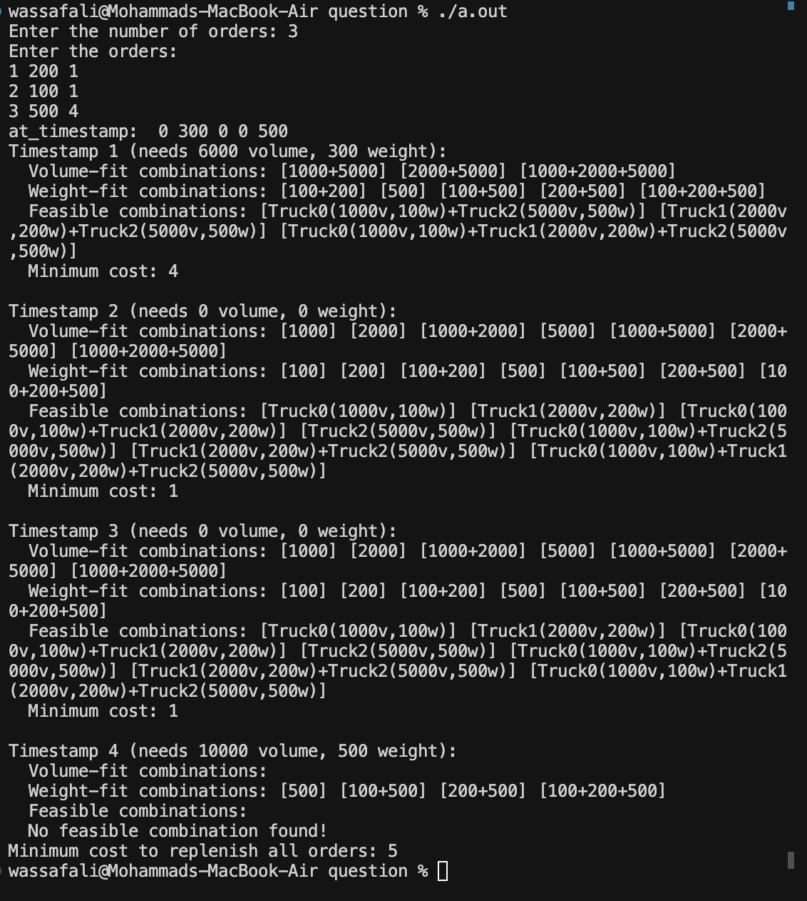

# Truck Replenishment Cost Optimization


This project simulates a replenishment system where orders arrive over time and must be fulfilled using available trucks.  
Each truck has a weight and volume capacity, as well as a cost factor. The goal is to **minimize the total replenishment cost** while ensuring all orders are satisfied.

---

## 📌 Features
- Accepts multiple orders with:
  - `truck_id`
  - `units`
  - `timestamp`
- Calculates total demand (units → weight and volume) at each timestamp.
- Generates **all possible truck combinations** that can satisfy the demand.
- Intersects feasible combinations based on **both volume and weight**.
- Computes **minimum transportation cost** using truck-specific cost factors.
- Prints detailed debug information:
  - Demand at each timestamp
  - Volume-fit combinations
  - Weight-fit combinations
  - Feasible truck allocations
  - Minimum cost at each timestamp

---

## 🛠️ How It Works
1. **Orders Input**:  
   User enters number of orders and their details (`truck_id units timestamp`).

   Example:
   3
   1 200 1
   2 100 1
   3 500 4

2. **Demand Calculation**:  
The system aggregates total units required at each timestamp.

Example output:
at_timestamp: 0 300 0 0 500


3. **Combination Generation**:  
- For given demand (volume & weight), generate **all truck combinations**.
- Filter combinations that can satisfy **both weight and volume**.

4. **Cost Calculation**:  
Cost = `truck_cost_factor × distance`.

Trucks have the following parameters:
- Truck 0: 100w, 1000v, cost factor 1  
- Truck 1: 200w, 2000v, cost factor 2  
- Truck 2: 500w, 5000v, cost factor 3  

5. **Final Output**:  
Displays the minimum replenishment cost across all timestamps.

---

## 📊 Example Run

**Input**
Enter the number of orders: 3
Enter the orders:
1 200 1
2 100 1
3 500 4


**Output**



---

## ⚙️ Parameters
- `unit_w = 1` → Each unit = 1 kg  
- `unit_v = 20` → Each unit = 20 cubic meters  
- `dw = 1` → Distance from dark store to warehouse  
- `dd = 2` → Distance between dark stores  
- Truck capacities:
  - Weight: `{100, 200, 500}`
  - Volume: `{1000, 2000, 5000}`
- Cost factors: `{1, 2, 3}` (for trucks 0, 1, 2)

---

## 🚀 How to Compile & Run
```bash
g++ main.cpp -o replenish
./replenish


